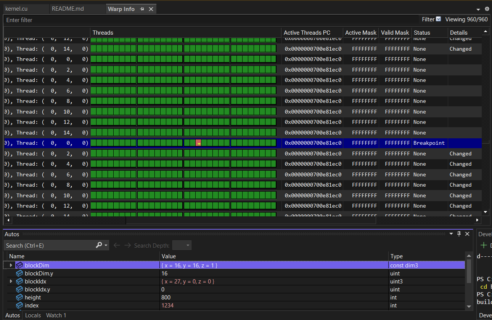
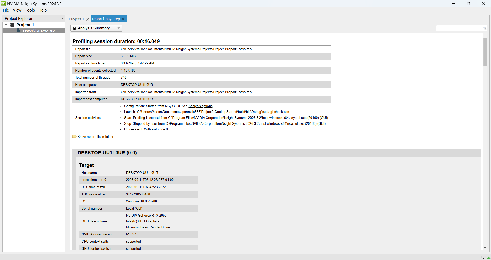
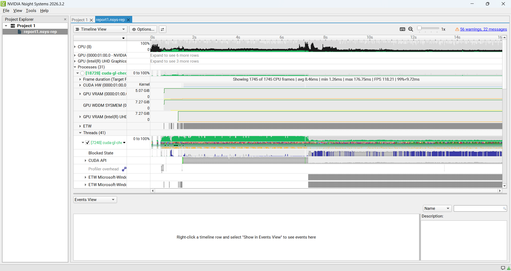
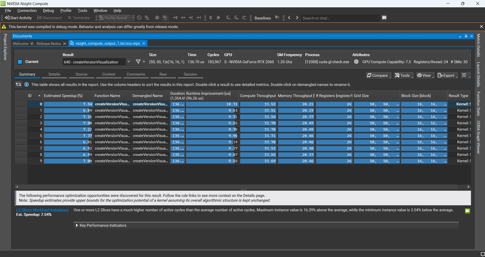
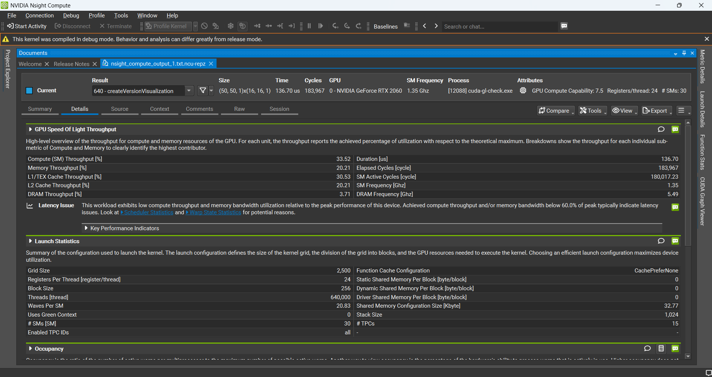
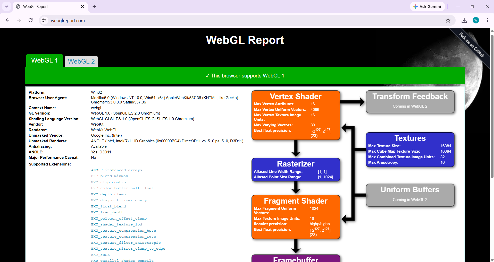
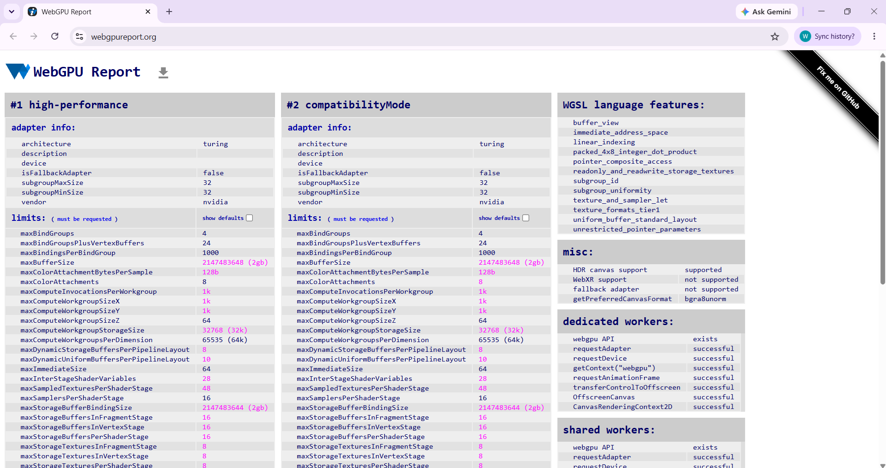

Project 0 Getting Started
====================

**University of Pennsylvania, CIS 5650: GPU Programming and Architecture, Project 0**

* Walson Li
  * [LinkedIn](www.linkedin.com/in/walsonli), [personal website](walsonli.com)
* Tested on: Windows 11 Home, i5-10300H @ 2.50GHz 16GB, RTX 2060 (Personal Laptop)

### 2.1.1 Build and Run CUDA GL Check

The compute capability of the RTX 2060 is 7.5

### 2.1.2 Modify the CUDA Project and Take a Screenshot

### 2.1.3 Nsight Debugging

### 2.1.4 Nsight Systems

#### Analysis summary

#### Timeline

### 2.1.5 Nsight Compute

#### Summary

#### Details

### 2.2: Project Instructions - WebGL

### 2.3: Project Instructions - WebGPU

